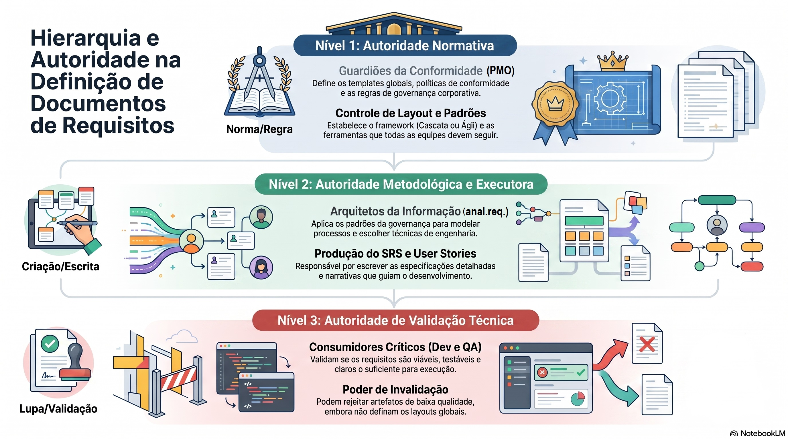

# DIO-Bootcamp-HEINEKEN-Desafio-NotebookLM
DIO Bootcamp HEINEKEN Desafio de Projeto com Notebook LM
Este repositório foi desenvolvido para o desafio de projeto da DIO, consolidando um estudo aprofundado sobre o ciclo de vida e a governança da Engenharia de Requisitos através do Google NotebookLM.

---

##  1. Contexto e Objetivos
*   **Tema Escolhido:** Governança de TI e Engenharia de Requisitos: Papéis, Autoridades e Modelos Documentais no Contexto Tradicional e Ágil.
*   **Objetivo de Estudo:** Investigar a dinâmica de responsabilidades entre as áreas de Governança, Requisitos, Desenvolvimento e QA na definição de artefatos de especificação. O foco é compreender os limites de autoridade técnica e normativa para evitar retrabalhos e garantir a qualidade do produto final.

---

##  2. Curadoria de Fontes
As seguintes fontes acadêmicas e profissionais foram carregadas no NotebookLM para formar a base de conhecimento deste caderno temático:

1.  **IT Business Analysis Professional**: *BRD vs FRD (Business Requirements Document vs Functional Requirements Document)*.
2.  **Repositório Institucional UFC**: *Engenharia de Requisitos em Aplicações Web: Perspectivas de Desenvolvedores e Analistas* (Universidade Federal do Ceará).
3.  **Repositório Institucional UFC**: *Guia de Metodologias e Boas Práticas em Engenharia de Requisitos*.
4.  **Alura**: *Governança de TI: Gestão de Requisitos no Contexto Ágil*.
5.  **Universidade Feevale**: *Validação de Requisitos Levantados por Equipe Não Técnica sob um Olhar dos Desenvolvedores* (Vicente Vieira Peixoto).
6.  **Ideativo Design**: *User stories vs Use cases: Entenda as diferenças e como aplicar*.
7.  **Estudo de Caso**: *Proposta de modelo de governança de projetos em uma empresa de saúde suplementar*.

---

##  3. Engenharia de Prompts e "Cicatrizes" (Troubleshooting)
As fontes apresentam uma análise profunda sobre responsabilidades entre as áreas de Governança, Requisitos, Desenvolvimento e QA na definição de artefatos de especificação. A governança do PMO define a obrigatoriedade de entrega dos documentos de especificação, enquanto a equipe de requisitos, na ausência de um layout corporativo, assume autonomia para propor o modelo ideal com bse em padrões de mercado. As equipes de desenvolvimento e QA, agindo como consumidoras do artefato, realizam revisões técnicas para validar a implementação e testabilidade, sem autoridade para definir o layout.

Abaixo, documenta-se o processo de mentoria e as 5 perguntas estratégicas realizadas no NotebookLM para mapear a matriz de responsabilidades do projeto:

###  Pergunta 1: Quem escolhe o tipo de documento a ser usado pelo analista: a governança, equipe de requisitos, desenvolvimento ou QA?
*   ** Resposta da IA:** Com base em padrões como MPS.Br e CMMI, a definição não é tarefa de um único papel, mas um esforço coordenado:
    1.  **Governança de TI:** Define as diretrizes gerais, políticas e regras sobre quais documentos devem ser concluídos. Delimita o método (Ágil ou Cascata) e os artefatos obrigatórios.
    2.  **Equipe de Requisitos:** Transforma as necessidades em artefatos formais (DRS, Histórias de Usuário), garantindo a rastreabilidade.
    3.  **Equipe de Desenvolvimento:** Atua como validadora técnica por meio de Revisões Técnicas Formais (RTF) para garantir a viabilidade.
    4.  **QA:** Foca na testabilidade, consistência e clareza, verificando se as especificações permitem criar casos de teste.

###  Pergunta 2: Se o PMO definir o uso de um documento, mas não houver layout específico, a equipe de requisitos pode buscar um padrão de mercado, ou Desenvolvimento e QA podem intervir?
*   ** Resposta da IA:** A equipe de requisitos pode e deve recorrer a padrões de mercado (como UML ou templates consagrados). Contudo, Desenvolvimento e QA atuam como validadores técnicos (critério GRE 2 do MPS.Br). Se o layout escolhido for ambíguo, o time técnico intervém para que o documento atenda aos critérios de qualidade e permita a criação de testes adequados.

###  Pergunta 3: Se o PMO local não tem o layout, mas a empresa possui governança global, deve-se adotar o recomendado pela empresa ou buscar padrões de mercado?
*   ** Resposta da IA:** O layout recomendado pela Governança Global deve ser adotado prioritariamente. A missão central da governança é a gestão do conhecimento e a padronização para garantir a perenidade organizacional. Padrões de mercado servem como inspiração na ausência de diretrizes internas, mas não substituem uma norma institucional já estabelecida.

###  Pergunta 4: Qual o limite de autoridade de cada um dos perfis na definição do documento de especificação?
*   ** Resposta da IA:** A autoridade é distribuída conforme as responsabilidades estratégicas e técnicas:
    *   **Governança:** Autoridade estratégica e normativa. Designa quais documentos são obrigatórios em cada etapa e define a stack corporativa.
    *   **Requisitos:** Autoridade descritiva e metodológica. Escolhe técnicas de elicitação e modelagem para registrar as necessidades de negócio.
    *   **Desenvolvimento:** Autoridade de viabilidade técnica. Pode invalidar um requisito se ele for tecnicamente inviável ou incompleto.
    *   **QA:** Autoridade de inspeção e testabilidade. Exige clareza para a criação de casos de teste e valida o resultado final antes da entrega.

###  Pergunta 5: Pode-se atribuir ao QA a autoridade de definir modelos ou layouts de documentação como se tivesse a atribuição de governança?
*   ** Resposta da IA:** Não. O papel do QA é focado na garantia da qualidade e inspeção técnica (consumidor crítico), não na criação de normas organizacionais globais. O QA pode propor checklists de qualidade e sugerir melhorias se o layout atual for frágil, mas a formalização e imposição do modelo exigem a chancela formal da Governança de TI.

---

## 4. Miniguia de Estudo (Entrega Final)

### Resumo Estruturado do Assunto
*   **Engenharia de Requisitos:** Processo essencial para alinhar as expectativas de negócio com a execução técnica. A formalização adequada reduz bugs em produção e o desperdício de esforço de engenharia.
*   **Pilares de Governança de Requisitos:**
    *   *Padronização:* Garante que equipes falem a mesma língua e reduz o impacto na rotatividade de pessoas.
    *   *Validação Multifuncional:* Requisitos precisam passar pelo crivo de quem constrói (Dev) e de quem testa (QA) antes de virarem código.
    *   *Rastreabilidade:* Conectar a dor do cliente, o documento de especificação, o código-fonte e o plano de testes.

### Glossário de Conceitos-Chave
*   **MPS.Br / CMMI:** Frameworks e modelos de maturidade que guiam a melhoria de processos de software em organizações.
*   **GRE 2 (Gerência de Requisitos):** Prática que foca em obter o entendimento dos requisitos junto aos fornecedores e colher o comprometimento da equipe técnica.
*   **RTF (Revisão Técnica Formal):** Reunião estruturada onde desenvolvedores inspecionam o documento de requisitos em busca de erros lógicos ou inviabilidades.
*   **Testabilidade:** Característica de um requisito que permite avaliar claramente se a funcionalidade construída atende ou não ao critério esperado através de um teste binário (passou/falhou).

### Prompts Reutilizáveis para Revisão Futura
*   `"A partir do contexto de Engenharia de Requisitos estudado, crie um infografico correlacionando a responsabilidade da documen tação técnica com os perfis de Governança, Requisitos, Dev e QA."`

---

##  Tecnologias Utilizadas
*   **Google NotebookLM** (Gerenciamento do conhecimento e curadoria das fontes da UFC, Alura e Feevale).
*   **GitHub** (Hospedagem da documentação oficial do portfólio).

---

